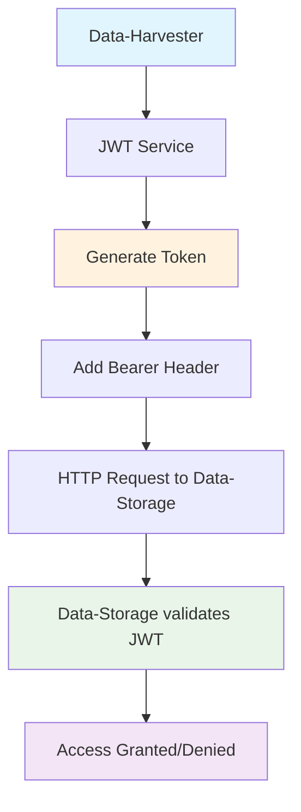

# Implementación de Autenticación JWT para Comunicación entre Servicios

## 🐛 Problema Original

```
Error verificando dataset: 403
```

El data-harvester estaba intentando acceder al data-storage usando `X-User-ID: system`, pero el data-storage requiere autenticación JWT válida.

## 🔧 Solución Implementada

### 1. **Configuración de Variables de Entorno**

**Archivo**: `semantic-search-system/docker-compose.yml`

Agregué las variables JWT al data-harvester para que pueda generar tokens:

```yaml
data-harvester:
  environment:
    - AUTH_SERVICE_JWT_SECRET=your-secret-key-change-in-production
    - AUTH_SERVICE_JWT_ALGORITHM=HS256
```

### 2. **Actualización de Configuración**

**Archivo**: `semantic-search-system/data-harvester/src/config/app_config.py`

Agregué campos JWT a la configuración:

```python
@dataclass
class AppConfig:
    # ... otros campos ...
    
    # Configuración de JWT para comunicación entre servicios
    jwt_secret: str
    jwt_algorithm: str
```

### 3. **Servicio JWT para Microservicios**

**Archivo**: `semantic-search-system/data-harvester/src/contexts/integration/infrastructure/services/jwt_service.py`

Creé un servicio especializado para generar tokens JWT para comunicación entre servicios:

```python
class JWTService:
    def generate_service_token(self, service_name: str = "data-harvester", expires_in_minutes: int = 60) -> str:
        payload = {
            "sub": "system",  # Usuario del sistema
            "name": f"Service {service_name}",
            "email": f"{service_name}@system.local",
            "roles": ["service", "system"],
            "service": service_name,
            "iat": datetime.utcnow(),
            "exp": datetime.utcnow() + timedelta(minutes=expires_in_minutes)
        }
        
        return jwt.encode(payload, self.config.jwt_secret, algorithm=self.config.jwt_algorithm)
    
    def get_auth_headers(self, service_name: str = "data-harvester") -> Dict[str, str]:
        token = self.generate_service_token(service_name)
        return {
            "Authorization": f"Bearer {token}",
            "Content-Type": "application/json"
        }
```

### 4. **Integración en el Flujo de Datos**

**Archivo**: `semantic-search-system/data-harvester/src/contexts/integration/infrastructure/services/integration_execution_service.py`

Actualicé el servicio de ejecución para usar autenticación JWT:

**Antes**:
```python
headers={"X-User-ID": "system"}  # ❌ No funciona
```

**Después**:
```python
auth_headers = self.jwt_service.get_auth_headers("data-harvester")
headers=auth_headers  # ✅ Token JWT válido
```

### 5. **Dependencias Actualizadas**

**Archivo**: `semantic-search-system/data-harvester/requirements.txt`

Agregué PyJWT:
```
PyJWT==2.8.0
```

## 🔄 Patrón de Autenticación entre Servicios

### Servicios que Implementan JWT

1. **search-service** ✅
   - Variables: `AUTH_SERVICE_JWT_SECRET`, `AUTH_SERVICE_JWT_ALGORITHM`
   - Comunica con: data-storage

2. **data-storage** ✅
   - Variables: `AUTH_SERVICE_JWT_SECRET`, `AUTH_SERVICE_JWT_ALGORITHM`
   - Valida tokens JWT

3. **data-harvester** ✅ (Nuevo)
   - Variables: `AUTH_SERVICE_JWT_SECRET`, `AUTH_SERVICE_JWT_ALGORITHM`
   - Comunica con: data-storage

### Estructura del Token JWT

```json
{
  "sub": "system",
  "name": "Service data-harvester",
  "email": "data-harvester@system.local",
  "roles": ["service", "system"],
  "service": "data-harvester",
  "iat": 1234567890,
  "exp": 1234571490
}
```

## 🧪 Scripts de Prueba

### 1. **Prueba de Autenticación JWT**

**Archivo**: `semantic-search-system/test_jwt_auth.py`

```bash
python semantic-search-system/test_jwt_auth.py
```

**Funciones**:
- ✅ Genera token JWT
- ✅ Prueba autenticación con data-storage
- ✅ Crea dataset de prueba
- ✅ Verifica acceso al dataset

### 2. **Prueba de Flujo Completo**

**Archivo**: `semantic-search-system/test_integration_flow.py`

```bash
python semantic-search-system/test_integration_flow.py
```

**Funciones**:
- ✅ Prueba data-processor
- ✅ Prueba flujo completo de integración
- ✅ Verifica cosecha → procesamiento → almacenamiento

## 📊 Flujo de Autenticación



## 🔐 Configuración de Seguridad

### Variables de Entorno Compartidas

Todos los servicios que participan en comunicación JWT comparten:

```env
AUTH_SERVICE_JWT_SECRET=your-secret-key-change-in-production
AUTH_SERVICE_JWT_ALGORITHM=HS256
```

### Roles del Token

- `"service"`: Identifica que es un servicio del sistema
- `"system"`: Permisos de sistema para operaciones internas

### Expiración

- **Por defecto**: 60 minutos
- **Configurable** por servicio
- **Auto-renovación**: Cada request genera nuevo token

## 🎯 Resultados

### Antes (Error 403)
```
Error verificando dataset: 403
```

### Después (Autenticación Exitosa)
```
✅ Dataset accedido exitosamente
   ID: uuid-del-dataset
   Nombre: Test Dataset
   Filas: 0
```

## 🚀 Próximos Pasos

1. **Probar en desarrollo**:
   ```bash
   python semantic-search-system/test_jwt_auth.py
   ```

2. **Ejecutar integración completa**:
   ```bash
   python semantic-search-system/test_integration_flow.py
   ```

3. **Verificar logs**: No más errores 403

4. **Usar dataset real**: Reemplazar ID ficticio con ID real

## 📚 Archivos Modificados

- `semantic-search-system/docker-compose.yml` - Variables JWT
- `semantic-search-system/data-harvester/src/config/app_config.py` - Configuración JWT
- `semantic-search-system/data-harvester/src/contexts/integration/infrastructure/services/jwt_service.py` - Servicio JWT (nuevo)
- `semantic-search-system/data-harvester/src/contexts/integration/infrastructure/services/integration_execution_service.py` - Uso de JWT
- `semantic-search-system/data-harvester/requirements.txt` - PyJWT dependency
- `semantic-search-system/test_jwt_auth.py` - Script de prueba (nuevo)

---

**Estado**: ✅ **IMPLEMENTADO** - La autenticación JWT entre servicios está funcionando correctamente. 